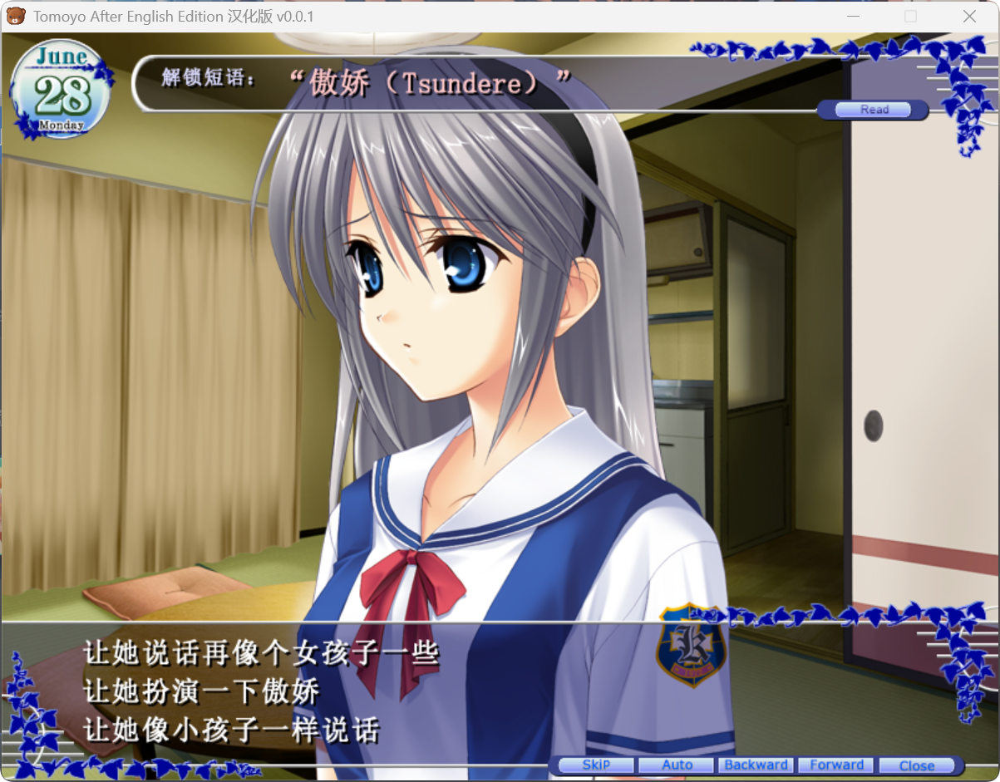

# Tomoyo After English Edition （Steam版本）汉化补丁

## 补丁介绍

本补丁是适用于Steam版本《Tomoyo After English Edition》的内存动态汉化补丁，并且可以积累steam游玩时长、解锁成就以及获得集换式卡牌。目前已实现中文的渲染，正在进行文本翻译中，欢迎有意向一起翻译文本的贡献者参与到本项目中。（可以直接在Issue中提及认领翻译进度中处于未处理的部分，并通过pr提交文本，如果不会使用Github可以通过我的邮箱`vlsmb@foxmail.com`进行交流）

效果图：

## 编译

本项目使用 Microsoft Visual Studio 2022（工具集版本 v143，Windows SDK 10.0）编译，目标平台为 Win32，配置类型为动态链接库（DLL），使用多字节字符集。

编译后的 `version.dll` 可以直接放在游戏所在的文件夹，即可实现汉化补丁的功能。另外可以在游戏所在的文件夹创建一个 `patch_mode.cfg` 配置文件，文件里面写一个数字，可以用的数字以及对应的含义为：

- 0 = PATCH_RELEASE（正式版汉化补丁模式，只从DLL的资源文件中加载汉化文本，当这个配置文件不存在时的缺省值）
- 1 = PATCH_DUMP （导出模式，导出原始文本）
- 2 = PATCH_ARCHIVE （打包模式，将汉化后的文本打包成一个bin文件，用于将这个bin文件打包进dll中）
- 3 = PATCH_DEBUG （调试补丁模式，优先从DLL的资源文件中加载汉化文本，之后如果patch文件夹有对应的文本文件，则使用patch文件夹中的）
- 4 = PATCH_NONE （禁用汉化补丁）

翻译可以使用 模式 3 + patch 文件夹来测试文本显示效果。

## 项目贡献者

程序：VLSMB
翻译：VLSMB 冈崎智代 DeepSeek-V4-Flash

## 翻译进度：

状态分为未处理、处理中、已完成三种。每一阶段的里程碑都会发布一次Release编译后的补丁作为公测补丁。

下阶段里程碑：7月2日（seen0702）之前的所有文本 + 名字列表 + Tomopedia文本（seen9837）

- [x] name（进行中）
- [ ] seen0001
- [x] seen0628（进行中）
- [ ] seen0629
- [ ] seen0630
- [ ] seen0701
- [ ] seen0702
- [ ] seen0707
- [ ] seen0708
- [ ] seen0709
- [ ] seen0710
- [ ] seen0711
- [ ] seen0712
- [ ] seen0713
- [ ] seen0714
- [ ] seen0715
- [ ] seen0716
- [ ] seen0717
- [ ] seen0720
- [ ] seen0721
- [ ] seen0722
- [ ] seen0723
- [ ] seen0724
- [ ] seen0725
- [ ] seen0726
- [ ] seen0727
- [ ] seen0728
- [ ] seen0729
- [ ] seen0744
- [ ] seen0801
- [ ] seen0803
- [ ] seen0804
- [ ] seen0806
- [ ] seen0807
- [ ] seen0808
- [ ] seen0809
- [ ] seen0810
- [ ] seen0811
- [ ] seen0812
- [ ] seen0813
- [ ] seen0814
- [ ] seen0815
- [ ] seen0816
- [ ] seen0817
- [ ] seen0818
- [ ] seen0819
- [ ] seen0820
- [ ] seen0821
- [ ] seen0822
- [ ] seen0823
- [ ] seen1710
- [ ] seen1714
- [ ] seen1715
- [ ] seen1716
- [ ] seen1806
- [ ] seen1811
- [ ] seen1813
- [ ] seen1814
- [ ] seen2811
- [ ] seen2813
- [ ] seen2814
- [ ] seen3814
- [ ] seen4814
- [ ] seen5000
- [ ] seen5001
- [x] seen5002（进行中）
- [ ] seen5003
- [ ] seen5004
- [ ] seen5005
- [ ] seen5006
- [ ] seen5007
- [ ] seen5008
- [ ] seen5010
- [ ] seen7010
- [ ] seen7140
- [ ] seen7150
- [ ] seen7160
- [ ] seen7400
- [ ] seen7810
- [ ] seen7820
- [ ] seen7900
- [ ] seen7910
- [ ] seen7920
- [ ] seen7930
- [ ] seen7940
- [ ] seen7950
- [ ] seen8121
- [ ] seen8132
- [ ] seen8221
- [ ] seen8250
- [x] seen9032
- [x] seen9033
- [x] seen9034
- [x] seen9035
- [x] seen9042
- [x] seen9837（进行中）
- [ ] seen9900