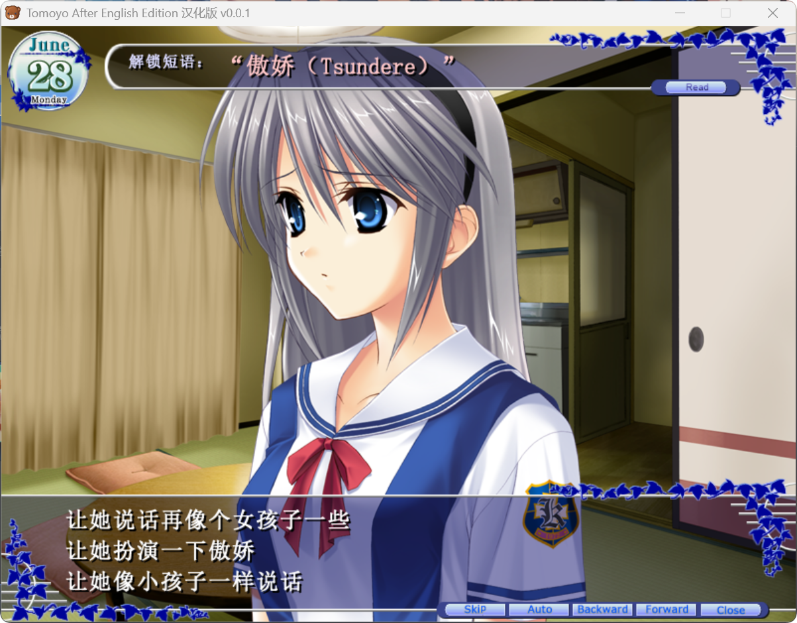

# Tomoyo After English Edition （Steam版本）汉化补丁

## NOTICE

本补丁是源码可见但不可用于任何商业用途的项目，允许非商业目的的使用、修改与分发，禁止将当前项目及其任何基于当前项目的修改版本用于任何商业用途。本补丁按"原样"提供，不提供任何担保。更详细的说明参见 [NOTICE.md](NOTICE.md) 文件，如果当前概述与 NOTICE 产生冲突，以 NOTICE 的说明为准。

## 补丁介绍

本补丁是适用于Steam版本《Tomoyo After English Edition》的内存动态汉化补丁，并且可以积累steam游玩时长、解锁成就以及获得集换式卡牌。目前已实现中文的渲染，正在进行文本翻译中，欢迎有意向一起翻译文本的贡献者参与到本项目中。可以在 Issue 中进行交流和随时反馈bug或者文本翻译的疏漏。

每当翻译了一部分文本，或者dll源代码有重大更新时，都会发布一次Release编译后的补丁作为公测补丁。

效果图：

## 编译

本项目使用 Microsoft Visual Studio 2022（工具集版本 v143，Windows SDK 10.0）编译，目标平台为 Win32，配置类型为动态链接库（`VersionInjectionPatch`项目），使用多字节字符集。

可以直接将编译后的 `version.dll` 和 `patch` 文件夹的文本资源放在游戏所在的文件夹，即可实现汉化补丁的功能。编译产物中还有一个 `PatchResourcePacker.exe`，可以将 `patch` 文件夹的文本内容打包成一个 `SEEN_CHS.TXT` 二进制文件，在分发汉化补丁时只分发 `version.dll` 和 `SEEN_CHS.TXT` 这两个文件的效果与 `version.dll` 和 `patch` 文件夹相同。（补丁优先读取 `patch` 文件夹的内容）。

> 如果只修改了文本而没有修改补丁程序的代码，则可以直接使用已有的 [编译产物](https://github.com/VLSMB/TomoyoAfterSteamCHSPatch/releases) 而无需再次编译。

## 项目贡献者

程序：VLSMB

特别鸣谢 will86863 测试本项目并提出了几个关键的bug
